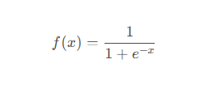
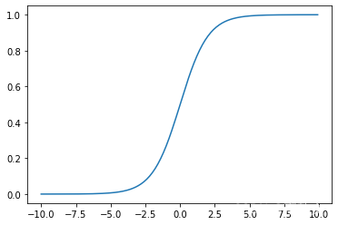
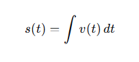
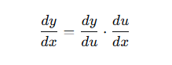

# 0基础无微积分前置知识笔记

## 一、Excel案例：我的第一个神经网络

我学习到了神经网络的前向传播和反向传播，现将相关代码和学习过程，以及相关笔记和感悟记录，希望通过记录所学知识，未来忘记的时候可以复习，也希望可以帮助更多对机器学习和神经网络感兴趣，但是又没有相关知识的朋友。

## 二、Excel案例：我的第一个神经网络

在我印象里，机器学习只有本科研究生数学水平的人才能学会的，我作为一个初中数学水平的人，一直对神经网络很感兴趣，但是我不会高等数学，因为我连高中都没有读过，就连高中数学都没有接触过，更别说高等数学，同时因为不了解相关前置知识，又不会英语，导致国内的视频看不懂，国外的英语教材也看不懂......

转折点在最近(2025年12月19日)，我在bilibili刷短视频的时候，刷到了[【【AI入门】【用Excel实现神经网络】】](https://b23.tv/yhO6559) 。因为看标题是使用Excel实现神经网络，所以我想看看是怎么回事，但是发现这也还是一个教程，带着心中对机器学习知识的渴望和无法学习的不甘，我想也没想的在评论区吐槽着零基础学不会，但是作者老师回复我，说这就是面向零基础的系列课程，而且还有Excel实现案例，我就抱着玩玩的心态，到github上下载了Excel案例 [zeroai](https://github.com/jiangsongyi0204/zeroai)，在电脑上运行。

原来神经网络是长这个样子的，这个神经网络是一个吃豆人的操作网络，九宫格里面，红色代表吃豆人的位置，绿色代表豆子的位置，豆子出现时，红色格子里的箭头代表要向哪个方向前进才能以最少步数吃到最多豆子，右侧的数据格子是权重数据，最右侧的是训练数据，一行代表一条数据，左侧的P1到P8代表输入的数据，右侧A1到A4代表这条数据的答案：

点击初始化神经网络，点击批量训练，然后点点点，点十几下，点的过程中发现线条变得粗细不一，然后再点测试按钮，就可以发现这个神经网络很神奇，通过某种计算，就可以让吃豆人吃到豆子：

## 三、揭开神经网络的面纱：前向传播与反向传播

这和我一开始我想的一样，就是众所周知的只有三层节点的网络，等我尝试复刻的时候，我发现这个如果只存在三层节点，根本无法做任何计算，因为计算是需要等式，而这三层节点，第一层节点存的是输入的参数，中间层的节点和最后一层节点存储的是计算结果，所以其中肯定存在别的计算参数，通过与输入参数进行计算才能得出结果，然后经过两轮计算才能得到最终的结果。

但是在右侧，我看到神经网络中还包含两个权重参数和两个偏置参数：

我突然想到，肯定是这两个参数参与计算，才能得出结果，所以实际上并非三层节点，而是3层节点+2层权重+2层偏置=7层节点，通过某种形式的计算，才得出来最终的结果，所以，刚刚那个红色和蓝色的线条，其实就是权重，所以线条会在训练后变粗：

上面是一个简化简化过的两层神经网络之间的计算过程示意图，图中的A代表输入层，W代表输出层，B代表偏置层，O代表输出层，作者老师说，通过以下公式计算出结果：
~~~text
输入层数据 * 权重1 + 偏置1 = 计算结果
input * weight1 + bias1 = temp_result

使用sigmoid激活函数函数计算此结果，得到隐藏层数据
sigmoid(temp_result) = hidden

隐藏层数据 * 权重2 + 偏置2 = 计算结果2
hidden * weight2 + bias2 = temp_result2

最后使用softmax激活函数将计算结果2的数据转化为总和为1(100%)的数，然后放在输出层
softmax(temp_result2) = output
~~~

> 这里的sigmoid函数和softmax函数属于激活函数，并没写出函数的内容，相当于占位符。
> 
> 作用是将线性计算的结果“挤压”或“归一化”到特定范围，使网络能学习非线性关系。
> 
> 可以简单理解为其中的参数经过某种计算以后，得到等号右边的结果，函数的具体内容在后面数学知识部分有讲解

当我尝试推导反向传播时，我发现它就像调整空调温度的过程，把`A`比作要调节的温度，`W`需要调整多少度，`B`至少要调节的度数，然后`temp_result`最终调整完成的温度。但是光调温度还不行，还要知道这个温度到底是冷还是热，这就需要心里面有一条判断温度的标准线，通过人体去体验这个温度是否合适，而这个判断的过程就是激活函数（Logistic）。

开空调的神经网络结果，会被softmax将最终的计算结果转化为概率。比如设置了五个心里答案，很热，有点热，正常，凉快，有点冷，通过转化概率，五个预期答案出现的概率总和是100%。比如很热12%，有点热38%，正常20%，凉快16%，有点冷14%，那么最大概率就是有点热。接下来就看哪个温度符合实际情况，如果温度高于或者低于自己的心理预期，就要往正确方向调整空调温度，神经网络也是走的这个过程。

因为神经网络无法一开始就判断空调温度的高低，就需要训练，输入当前空调温度，外界温度，以及其他环境因素，然后输出结果，根据正确答案和输出结果，调整空调温度，如果每次调1摄氏度，那调整的学习率就是1/(空调最高温 - 空调最低温)，让空调温度和我们觉得舒服的温度的差距变小，因为事先不知道最合理的温度是多少，所以需要小步快走，多次调整，直到达到我们想要的温度为止，这就是学习过程。

由多个计算过程的叠加，就形成了一个完整的针对多个指标的处理和判断的程序，比如同时输入温度，湿度，去判断体感温度是冷是热，空气是否干燥，是否潮湿等，这就是神经网络的原理，判断的方法有很多，这里使用`sigmoid`函数作为判断标准，通过有时候通过初次判断和再判断，会让结果更加的准确，所以会设计成多层的神经网络。

## 四、数学没那么可怕：微积分与链式法则的直观理解

开空调的时候，就是前向传播的过程，也是预测温度的过程，然后觉得冷，主动去调整空调温度，就是学习的过程，就是反向传播过程。

经过对神经网络的初步认识，就可以直接根据现有的公式进行计算，我也是在学习后得出结论，数学公式并没有那么高深莫测，只要知道符号含义，计算规则，就可以看懂这个数学公式，看不懂公式，是因为从来没有人告诉我们公式里的符号是什么意思，如何去计算。

学习神经网络需要的几个知识点都可以跟生活中常见的事物联系起来，并不难理解，这些知识点，分别是微积分、链式法则、计算图、还有一点矩阵向量的知识，这些知识的名字看起来让人感到非常恐惧，但是请不要害怕，觉得困难，只是我们对数学不够了解，以及对数学知识的敬畏之心。

### 4.1、公式和数学知识讲解

微积分描述的是一个事物变化过程中的量，这个量不是固定的，是一直在变化的，像方程，但是方程有固定量，而微积分没固定量，没有固定量，意味着你可以带入任何数字到式子中，然后计算出结果，这些结果可以连接成一条线，这条线就是数学中的函数图。

#### 4.1.1 函数

定义函数的目的是为了将复杂的公式简单化，让人方便的对多个复杂的公式进行计算，如果整个复杂的公式能写一本书，那函数就是这本书的目录，通过目录，可以知晓整个公式的计算目的，我们可以给这个式子命名，比如叫`sigmoid`函数，`sigmoid`函数已经被数学家定义好了，就像三角函数或者其他的什么函数一样，只需要理解其中符号的原理，然后拿来用就好：

函数公式中的`f(x)`表示我要定义一个函数，这个函数需要根据x求出结果，等号右边就是该函数的展开式，展开式就是函数的内容，定义函数的好处是简化式子，我们可以设x为一个具体的数字，把这个具体的数字带入到等号右边的`x`中进行计算，通过函数的展开式计算出最终的结果。

> 这个函数展开式里面的e是一个常数，此函数的计算原理后面会说明，也可以自行询问AI，让AI给出更详细的描述。

这个函数在函数图中的坐标如下：

学会函数定义之后，我们自己就可以自定义一个属于自己的函数`f(x)`，或者`f(n, m)`，参数可以自己定义，内容也可以自己定义，比如`sigmoid`函数和`softmax`函数就是创造神经网络的数学家或者计算机科学家们定义的。

#### 4.1.2、微积分

搞清楚函数之后，接下来就到微积分了，微积分是一种计算方式，我们小学初中的时候，就曾经学习过圆形的面积公式，圆形的面积公式的原理是通过想象把圆切割成无数个小三角形，越小的三角形，弧度就越接近直线，这时候将这些三角形组合成一个平行四边形，利用平行四边形的公式，就可以求出来该圆的面积，这就是积分。

这种先切割成无数简单的单元，再组合成可以简单理解的整体的思想，就是微积分思想，所以以前老师说，圆的面积公式是由微积分推导出来的，这就是微积分在生活中的其中一个应用场景。

我们生活中经常用到微积分相关的知识和思想，在生活中还有其他使用微积分的例子，比如路程公式：速度 * 时间 = 路程，这个公式也使用到了微积分的思想。只不过在现实中，我们的速度是不稳定的，可能随着时间越来越快，或者随着时间越来越慢，这种情况会在函数图像中形成一条曲线，只是我们一般只需要计算出来平均速度，而微积分可以通过对路程公式的微分和积分，计算出某个瞬间的速度（加速度），而不仅仅是总体的平均速度。

路程S = 速度v * 时间t，可以得出一个结论，路程的组成部分是速度和时间，而在微积分中，路程是无数个瞬间所走过的路程组合在一起的，也就是无数个速度碎片通过时间组成路程，这种拆分的过程叫微分，不同的时间下，加速度就不一样，组合起来就叫积分：

> 如果速度是时间的函数 v = v(t)，而s是v对时间的积分，就可以得出下列微积分公式，其中的f是微分符号，表示其中一小部分，d是积分符号，表示整体和全部的意思。

现在已经求出整体，但如果需要通过整体去求这个积分函数的组成部分，可以用`ds/dt = v(t)`，读作s对t的导数等于v(t)，从理解上来看，斜杠是一个除号，而导数就是我们需要寻找的答案，相当于路程除以速度等于时间，而这里的三个项都是函数，所以叫求导数:

#### 4.1.3 链式法则

在实际计算中，一个函数整体可能是多个函数的嵌套组成的，我们必须对一些复杂的算式进行简化，然后用简单的表达式来表示他们之间的关系，以便推导和求导，在推导完成后，再进行详细的展开计算，微积分中的**链式法则**公式，是求导的关键，如果有一个函数`y = f(g(x)) * g(x)`，其中y是x的复合函数，求y对x的导数，可以写为：

这个公式看起来很复杂，就可以用莱布尼茨记法简写来替代函数，设u = g(x)，则y = f(u)，则y对x的导数等于y对u的导数乘以u对x的导数：

### 4.2 前向传播的过程

### 4.3 反向传播的过程和推导

前向传播其实是根据以下的顺序进行计算的：
~~~
o = softmax( w₂ · sigmoid( w₁·a + b₁ ) + b₂ )
~~~

以上公式看起来很复杂，但是可以将其转换为以下计算过程：

a → [a·w₁ + b₁] → m → sigmoid → h → [h·w₂ + b₂] → z → softmax(z) → o

> 其中的每一个节点都可以是一个函数，每一个括号也可以是一个函数

一般情况下，不需要主动去推导反向传播的过程，除非是为了了解神经网络的底层原理，以下就是这个神经网络的反向传播的推导过程：

在反向传播中，需要通过链式法则对当前函数的组成部分进行求导，因为函数之间的关系就是组合关系，需要找该函数的组成部分，就需要使用链式法则公式`dy/dx = dy/du * du/dx`进行求导，

求softmax的导数：

> 因为o函数的直接组成部分只有`z`，因为`o`是直接通过`z`函数计算得出的结果，所以首先需要对`z`进行求导，`z`经过`softmax`函数的计算，所以求`z`的导数就是`loss`函数，设真实标签为y，即`dL/dz = (o - y)`。因为整个网络结构都是一个完整的算式，所以可以根据链式法则，找到对应函数的组成部分，比如`h * w₂ + b₂ = z`，z函数的组成部分是`h`和`w`，而此处的`b`在函数图像中用于平移，并不影响函数图像的形状，`b`的输入总是1，所以误差对`b`的导数，就等于传递到该层的误差值本身。

求w₂和b₂的导数：

> 根据`h * w₂ + b₂ = z`可以得出对应的求导表达式`dz/dw₂ = h`，`dz/b₂ = 1`，`dz/dh = w₂`，因为此处局部表达式的`h`和`w₂`前面没有数，所以不再分解。因为要修改w₂，可以得出`dL/dw₂ = dL/dz * dz/dw₂ * 1`，但是一般不写1，所以简化为`dL/dw₂ = dL/dz * dz/dw₂`，因为`dz/dw₂ = h`，所以简化为`dL/dw₂ = dL/dz * h`，与学习率相乘，再赋以负号表示反方向调节，让`w₂`加上这个数进行调节就完成对`w₂`的调整。
> 
> 修改`b₂`的式子为`dL/db₂ = dL/dz * dz/db₂`，因为`dz/b₂ = 1`，所以`dL/db₂ = dL/dz`，与学习率相乘，再赋以负号表示反方向调节，让`b₂`加上这个数进行调节就完成对b₂的调整。

求输入层到隐藏层中w₁和b₁的导数：

> 对`sigmoid`求导得`dh/dm = h*(1 - h)`，根据`a * w₁ + b₁ = m`，得`dm/dw₁ = a`, `dm/b₁ = 1`，需要修改w₁，所以求`dL/dw₁：dL/dw₁ = dL/dh * dh/dm * dm/dw₁`;
> 
> 求`dL/db₁`: `dL/db₁ = dL/dh * dh/dm`，同样将结果与学习率相乘，再赋以负号调节即可。

## 五、总结与学习感悟

首先感谢[【【AI入门】【用Excel实现神经网络】】](https://b23.tv/yhO6559)视频给我的提示和启发，此视频以及相关Excel文件，降低了我理解神经网络的门槛，作者老师也给了我帮助，在此感激不尽。

通过这次的学习，我发现学习机器学习的困难点，并非知识本身，而是难以找到一个适合自己的教程，从零到一的过程非常艰难，只要跨过从零到一的过程，往后的路就会平坦很多。我不仅学会看各种公式，我还会推导普通三层网咯的反向传播的过程，我还发现，微积分的求导公式其实可以通过百度或者AI查询，帮助我们推导，因为不用考试，所以我只需要关注我需要使用的那部分知识，不用分散注意力到其他地方，这也是学习进展势如破竹的原因。

