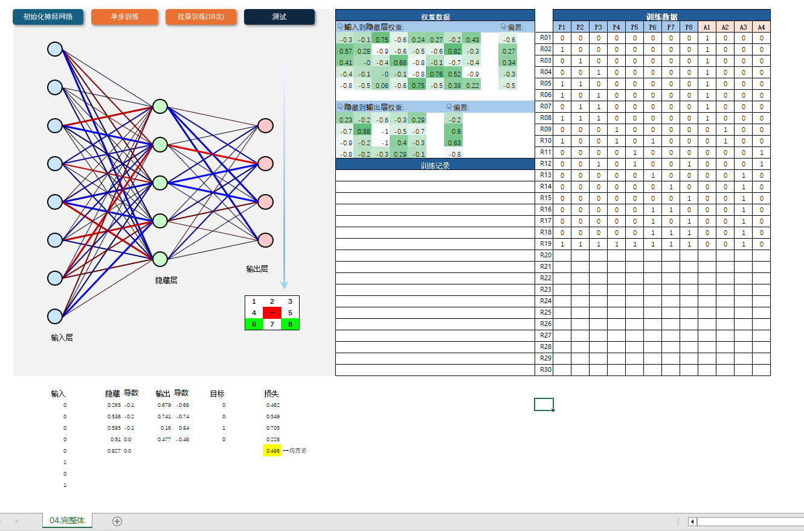
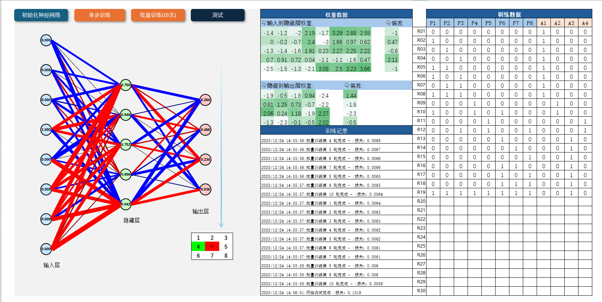
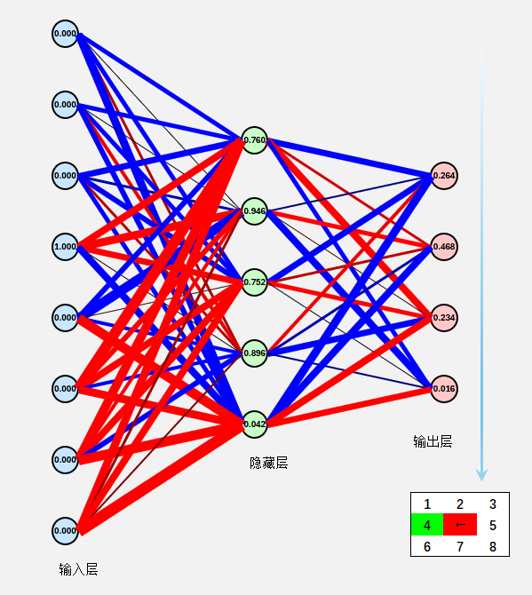
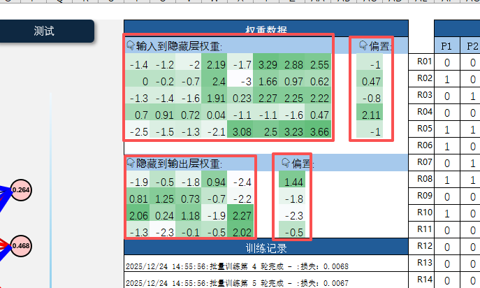
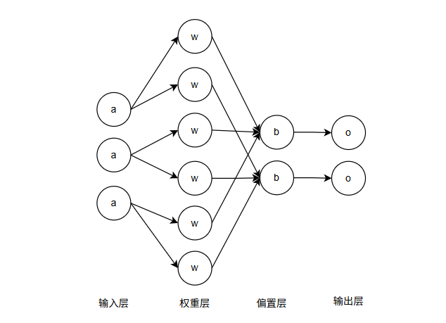

# simple-neural-network-learning

0基础无微积分前置知识，学习简单神经网络的原理和使用java代码复刻

## 一、项目背景知识

我学习到了神经网络的前向传播和反向传播，现将相关代码和学习过程，以及相关笔记和感悟记录，希望通过记录所学知识，未来忘记的时候可以复习，也希望可以帮助更多对机器学习和神经网络感兴趣，但是又没有相关知识的朋友。

## 二、初步认识神经网络时的感受

在我印象里，机器学习只有本科研究生数学水平的人才能学会的，我作为一个初中数学水平的人，一直对神经网络很感兴趣，但是我不会高等数学，因为我连高中都没有读过，就连高中数学都没有接触过，更别说高等数学，同时因为不了解相关前置知识，又不会英语，导致国内的视频看不懂，国外的英语教材也看不懂......

转折点在最近(2025年12月19日)，我在bilibili刷短视频的时候，刷到了[【【AI入门】【用Excel实现神经网络】】](https://b23.tv/yhO6559) 。因为看标题是使用Excel实现神经网络，所以我想看看是怎么回事，但是发现这也还是一个教程，带着心中对机器学习知识的渴望和无法学习的不甘，我想也没想的在评论区吐槽着零基础学不会，但是作者老师回复我，说这就是面向零基础的系列课程，而且还有Excel实现案例，我就抱着玩玩的心态，到github上下载了Excel案例 [zeroai](https://github.com/jiangsongyi0204/zeroai)，在电脑上运行。

原来神经网络是长这个样子的，这个神经网络是一个吃豆人的操作网络，九宫格里面，红色代表吃豆人的位置，绿色代表豆子的位置，豆子出现时，红色格子里的箭头代表要向哪个方向前进才能以最少步数吃到最多豆子，右侧的数据格子是权重数据，暂时不清楚是做什么用的，最右侧的是训练数据，一行代表一条数据，左侧的P1到P8代表输入的数据，右侧A1到A4代表这条数据的答案：

点击初始化神经网络，点击批量训练，点点点，点十几下，然后再测试，发现这个神经网络确实像训练的那样，确实可以让吃豆人吃到豆子，同时发现线条变粗了：

## 三、研究复刻神经网络

这和我一开始我想的一样，就是众所周知的只有三层节点的网络，等我尝试复刻的时候，我发现这个如果只存在三层节点，根本无法做任何计算，因为计算是需要等式，而这三层节点，第一层节点存的是输入的参数，中间层的节点和最后一层节点存储的是计算结果，所以其中肯定存在别的计算参数，通过与输入参数进行计算才能得出结果，然后经过两轮计算才能得到最终的结果。

但是在右侧，我看到神经网络中还包含两个权重参数和两个偏置参数：

我想到了，肯定是这两个参数参与计算，才能得出结果，所以实际上并非三层节点，而是3层节点+2层权重+2层偏置=7层节点，通过某种形式的计算，才得出来最终的结果，所以，刚刚那个红色和蓝色的线条，其实就是权重，所以线条会在训练后变粗：

上图是一个简化的示意图，图中的A代表输入层，W代表输出层，B代表偏置层，O代表输出层，通过一些计算得出最终的结果，上图就是两层神经网络的计算过程，所以
TODO：=========================================================================

实际上在输入层和隐藏层之间有权重参数和偏置参数，经过加权计算，以及使用sigmoid函数计算以后，才会将计算结果保存到隐藏层，随后再经过另一个权重参数和偏置参数计算，最后将数据存储到输出层，再经过softmax计算出置信度，把所有的输出结果以百分比的小数形式显示出来。

然后整个神经网络最核心的部分其实是权重，偏置参数还有配置参数，以及运行这个神经网络所使用的算法。输入层，隐藏层，输出层，反而不是最重要的，这三个层只是用于存储计算结果，跟我认识的三层神经网络结构还是很不一样的，我的主观感受是这样的。

然后神经网络的学习是基于反向传播的，根据当前输出层的结果，以及正确答案，去计算出来实际的误差值，跟学习率和隐藏层输入的值，去计算出对应的权重参数和偏置参数所需要调整的大小，学习率用来控制调整强度，经过多轮调整后才能达到预期效果。

接下来的隐藏层和前面的权重层，以及偏置参数是如何计算调整的，具体的原理我还不理解，没办法继续了，AI跟我说是跟微积分的链式法则有关系。

我现在感觉脑子不够用了，因为我的数学知识只停留在初中，我只是会写一些代码，所以很多与代码相通的概念就比较容易理解，不过我不知道怎么理解没有答案也可以计算出隐藏层误差的情况，明天再继续想了，以上是我这个0基础没有数学知识的人所理解的内容，可能不太准确

前向传播其实是根据以下的顺序进行计算的
a → [a·w₁ + b₁] → m → sigmoid → h → [h·w₂ + b₂] → z → softmax(z) → o
在反向传播中，需要通过链式法则对当前函数的组成部分进行求导，因为函数之间的关系就是组成关系，需要找该函数的组成部分，就需要使用链式法则公式dy/dx = dy/du*du/dx，

例如：a * b = c，dc/db = a，读作c对b的偏导数等于a，dc/da = b，c对a的偏导数等于b，可以理解为，函数c是由函数a和函数b组成。

因为o函数的直接组成部分只有z，所以需要对z进行求导，z经过softmax函数的计算，所以求z的导数就是loss函数，设真实标签为y，即dL/dz = (o - y)，
因为整个网络结构都是一个完整的算式，所以可以根据链式法则，找到对应函数的组成部分，
比如h * w₂ + b₂ = z，z函数的组成部分是h和w，而此处的b在函数图像中用于平移，并不影响函数图像的形状，
也不会影响预测值在函数图像中相对于函数图像的落点，所以这里的b导数是1，但是一般不写，

根据h * w₂ + b₂ = z可以得出对应的求导表达式dz/dw₂ = h，dz/b₂ = 1，dz/dh = w₂，因为此处局部表达式的h和w₂前面没有数，所以不再分解
因为要修改w₂，可以得出dL/dw₂ = dL/dz * dz/dw₂ * 1，但是一般不写1，所以简化为dL/dw₂ = dL/dz * dz/dw₂，
因为dz/dw₂ = h，所以简化为dL/dw₂ = dL/dz * h，与学习率相乘，再赋以负号表示反方向调节，让w₂加上这个数进行调节就完成对w₂的调整，
修改b₂的式子为dL/db₂ = dL/dz * dz/db₂，因为dz/b₂ = 1，所以dL/db₂ = dL/dz，与学习率相乘，再赋以负号表示反方向调节，让b₂加上这个数进行调节就完成对b₂的调整，

对sigmoid求导得dh/dm = h*(1 - h)，根据a * w₁ + b₁ = m，得dm/dw₁ = a, dm/b₁ = 1，需要修改w₁，
所以求dL/dw₁：dL/dw₁ = dL/dh * dh/dm * dm/dw₁;
求dL/db₁: dL/db₁ = dL/dh * dh/dm，同样将结果与学习率相乘，再赋以负号调节即可。